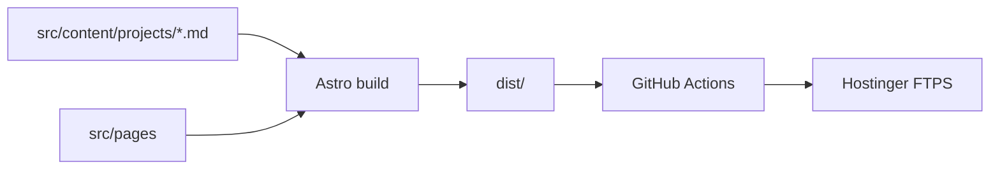

# Architecture — Portfolio-RMichels (Astro)

## Overview

The site is a **static Astro** build. All HTML is generated at build time from:

- **Pages** in `src/pages/` (and `src/pages/de/` for German)
- **Project metadata + body** in `src/content/projects/*.md`
- **UI strings** in `src/i18n/ui-en.json` and `ui-de.json`
- **Roles** for filtering in `src/lib/roles.ts`

No MySQL or PHP at runtime after cutover.

## Build Flow

## Routing

| URL | Source |
|-----|--------|
| `/` | `src/pages/index.astro` |
| `/about` | `src/pages/about.astro` |
| `/projects` | `src/pages/projects.astro` |
| `/futureEarth` | `src/pages/[slug].astro` + `slug` frontmatter |
| `/de/about` | `src/pages/de/about.astro` |

`astro.config.mjs` sets `i18n.defaultLocale: 'en'`, `prefixDefaultLocale: false`.

## Layouts

- **BaseLayout** — `<head>` (GA, hreflang, canonical, OG), Header, Footer, global islands
- **ProjectLayout** — case study shell: ProjectLanding, ProjectMeta, markdown body, optional Three.js mockup

## Client Islands

Loaded per page via `<script src="..." client:load|visible|idle>`:

| Island | Pages |
|--------|-------|
| LandingModel | Home |
| ProjectFilter | Home, Projects, About |
| ImageViewer, Lqip | Case studies |
| ThreeMockup | tourguide, clirioScanViews |
| ParticleWaves | All (footer) |
| Menu, LenisSetup | All |

## Content Model

Frontmatter fields (see `src/content/config.ts`):

- `slug` — URL override (camelCase; not in Zod — Astro reserved)
- `name`, `projectType`, `description` — `{ en, de }`
- `year`, `roles`, `links`, `heroAltLayout`, `threeMockup`, `inDevelopment`, `order`

Markdown body = former `#projContent` HTML converted to MD.

## Coexistence with PHP (migration branch)

- Astro dev: `npm run dev` → `localhost:4321`
- Legacy PHP: XAMPP → `localhost`
- Until merge: PHP files unchanged; deploy workflow on branch targets `dist/`

## Subdomains

`subdomains/tourguide/` and others deploy separately; not part of Astro `dist/`.
