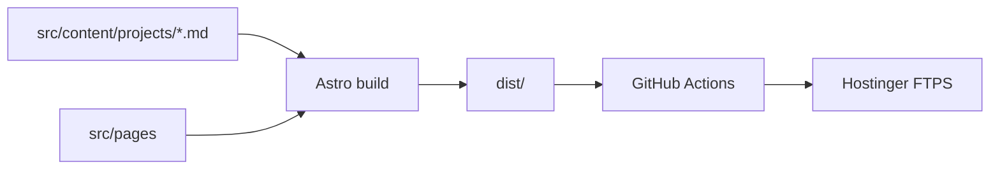

# Architecture — Portfolio-RMichels (Astro)

## Overview

The site is a **static Astro** build. All HTML is generated at build time from:

- **Pages** in `src/pages/` (and `src/pages/de/` for German)
- **Project metadata + body** in `src/content/projects/*.md` (EN) and `src/content/projects-de/*.md` (DE)
- **UI strings** in `src/i18n/ui-en.json` and `ui-de.json`
- **Roles** for filtering in `src/lib/roles.ts`

No MySQL or PHP at runtime after cutover.

## Build Flow



## Routing

| URL | Source |
|-----|--------|
| `/` | `src/pages/index.astro` |
| `/about` | `src/pages/about.astro` |
| `/projects` | `src/pages/projects.astro` |
| `/futureEarth` | `src/pages/[slug].astro` + `slug` frontmatter |
| `/de/about` | `src/pages/de/about.astro` |

`astro.config.mjs` sets `i18n.defaultLocale: 'en'`, `prefixDefaultLocale: false`.

## Layouts

- **BaseLayout** — `<head>` (GA, hreflang, canonical, OG), Header, Footer, global islands
- **ProjectLayout** — case study shell: ProjectLanding, ProjectMeta, markdown body, optional Three.js mockup

## Client Islands

Loaded per page via dynamic imports in `PageBoot.ts` or page `<script>` tags:

| Island | Pages |
|--------|-------|
| HomeWebGL | Home |
| ProjectFilter | Home, Projects |
| ImageViewer, Lqip | Case studies |
| ThreeMockup | tourguide, clirioScanViews |
| WebGLBackground | All (footer waves) |
| Menu, LenisSetup | All |

## Content Model

Two collections share the same Zod schema (`src/content/config.ts`):

| Collection | Purpose |
|------------|---------|
| `projects` | EN markdown body + bilingual frontmatter |
| `projects-de` | DE markdown body + duplicated frontmatter (parity validated in CI) |

Frontmatter fields:

- `slug` — URL override (camelCase; not in Zod — Astro reserved)
- `name`, `projectType`, `description` — `{ en, de }`
- `year`, `roles`, `links`, `heroAltLayout`, `threeMockup`, `inDevelopment`, `order`

Markdown body = case study HTML sections (former `#projContent`).

## Assets (local dev)

Large binaries live in tracked `assets/` at repo root. For local dev and CI, copy or junction into `public/assets/`:

```bash
cp -r assets public/assets   # CI / Linux
# Windows: mklink /J public\assets assets
```

Validation checks both `public/assets/` and `assets/`.

## Deploy

- **PR → `main`:** `npm ci` → sync assets → check → test → build → verify → Playwright E2E
- **Merge to `main`:** check → test:unit → test:content → build → verify → `dist/` via FTPS (`dangerous-clean-slate: false`, dist-specific state file; does not touch `/subdomains/*`)
- `public/.htaccess` → copied to `dist/` for Apache directory index and trailing slashes

## Subdomains

`subdomains/tourguide/` and others are deployed manually via FTPS; not part of Astro `dist/` or CI.

## Legacy

Pre-Astro PHP/LAMP artifacts are archived in `archive/lamp-legacy/` (not used at runtime).
